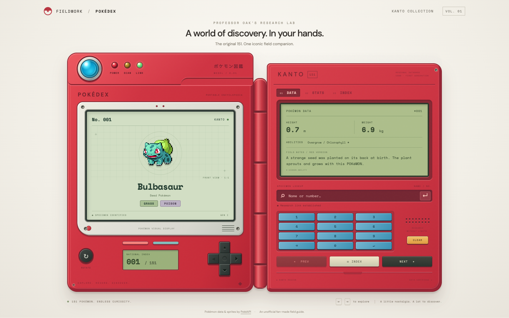
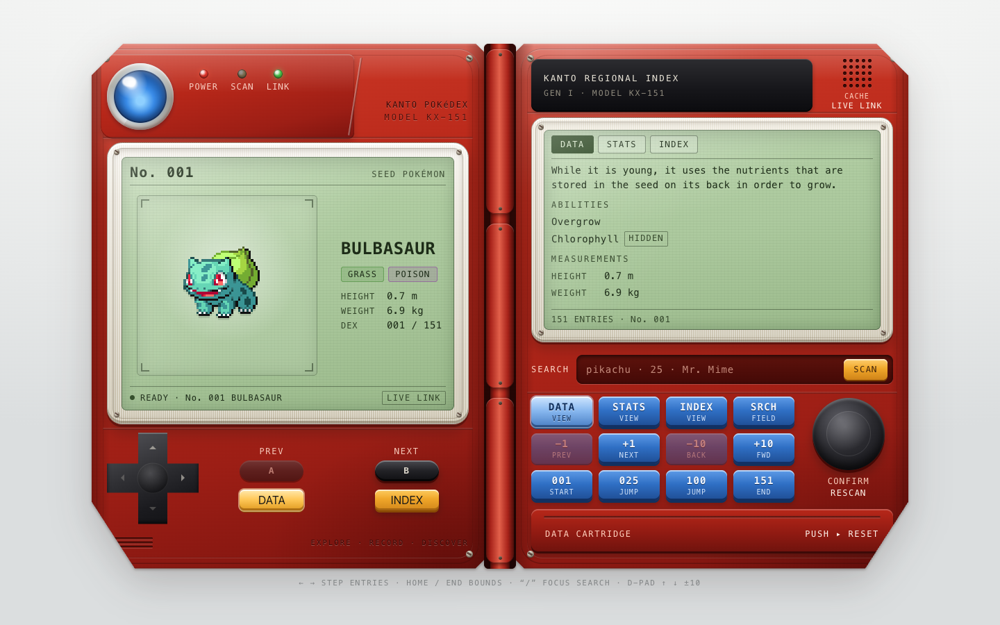
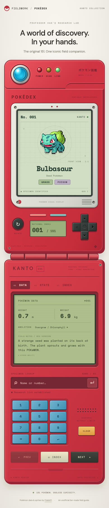
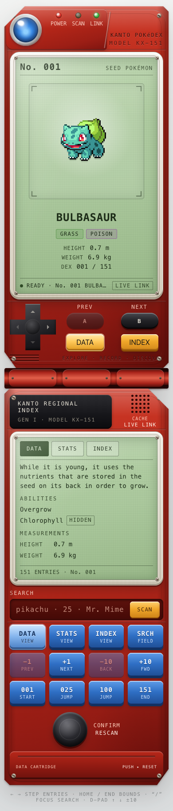
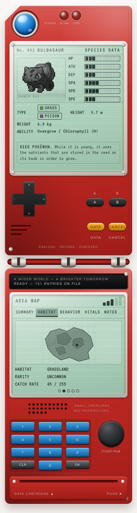

# Pokédex benchmark

**Run A was the fastest prototype. Run B had the strongest code. Run C looked closest to the reference.** All three worked in ordinary use, and all three still need robustness fixes.

Three implementations of the same task, reviewed independently by Fable 5.1 and Codex. Build a physical red Pokédex with real [PokéAPI](https://pokeapi.co/) data, the original 151 Pokémon, search, keyboard navigation, caching, and a usable mobile layout.

| Run A | Run B | Run C |
| --- | --- | --- |
|  |  |  |
| Fastest and fewest observed tokens | Best engineering | Closest visual match |

Screenshots show the initial Bulbasaur screen at 1440 × 900. Click an image to inspect it.

<details>
<summary>See the original reference and mobile screenshots</summary>

### Reference


### Mobile

Full pages captured at a 390 × 844 viewport. Each app scrolls vertically.

| Run A | Run B | Run C |
| --- | --- | --- |
|  |  |  |

</details>

## Results

| | Run A | Run B | Run C |
| --- | --- | --- | --- |
| Recorded implementation time | **8m 08s** | 32m 39s | 23m 27s |
| Observed workflow tokens | **1.33 million** | At least 33.76 million | At least 27.43 million |
| Code score, Fable / Codex | 57 / 65 | **86 / 80** | 66 / 69 |
| Visual score, Fable / Codex | 53 / 70 | 77 / 68 | **84 / 75** |
| Supplied tests passed | 26 | 52 | 95 |
| Verified monetary cost | Unknown | Unknown | Unknown |

Scores are out of 100 and reflect reviewer judgment. Token totals include cached input, output, and observed worker usage. They include the original completion reports but exclude later accounting work. Some retry usage is missing for B and C. These totals do not establish dollar cost, and recorded time is not time to a fully accepted product.

**Choose A for a quick prototype, B as the starting point for a maintained app, or C for its visual direction.** B has clearer state and data boundaries. A concentrates too much in one component. C has useful separation but more confirmed interaction bugs, including a late retry replacing the selected Pokémon and male Nidoran resolving to the female entry.

## Why the reviews differ

Both reviewers installed, tested, built, and drove the apps in a browser. Normal search, navigation, caching, and recovery from an HTTP 503 worked across all three.

Fable passed the functional gate and ranked A first overall because speed and token use outweighed its weaker code. Codex added malformed-response and cache-race probes. A deliberately malformed species response crashed every app and remained cached after reload. Codex therefore withheld overall acceptance. This was an injected fault, not something observed from normal live PokéAPI responses. Additional probes also found defects in B, so Fable's initial finding of no reproduced bugs in B is incomplete.

The useful middle ground is to show ordinary functionality and robustness separately, retain both reviewers' scores, and name the category leaders. Averaging everything into one winner would hide the acceptance disagreement. Both reviewers agree on the code ranking and that C most closely follows the reference. Visual scores vary more because they judge fidelity and presentation differently.

Fable counted 1.26 million tokens for A and 33.30 million for B. The table includes their final completion reports, which explains the difference. C's observed total agrees.

## Run locally

Use Node.js 22.12 or newer. Choose one project folder, then run the same commands.

| Run | Project |
| --- | --- |
| A | [pokedex-astra](pokedex-astra) |
| B | [pokedex-deepseek-v4.1-astra](pokedex-deepseek-v4.1-astra) |
| C | [pokedex-deepseek-v4.1-harness](pokedex-deepseek-v4.1-harness) |

```bash
cd pokedex-astra
npm ci
npm run dev
```

```bash
npm run typecheck
npm test
npm run build
```

The application source is unchanged. This repository contains the three projects, this summary, and comparison images. Raw transcripts, logs, private measurement records, generated builds, and temporary evaluation files stay out of Git.

This is one task with one submitted attempt per run. Folder names are preserved, but the provisional A/B/C mapping is not an independently verified model identity. The reviews are independent, although visible folder names compromised blinding. The results describe these submissions and do not establish a general model ranking.
