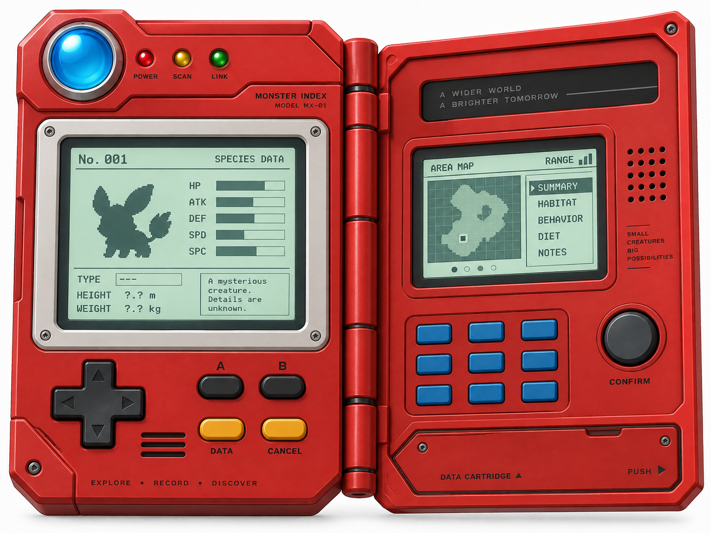
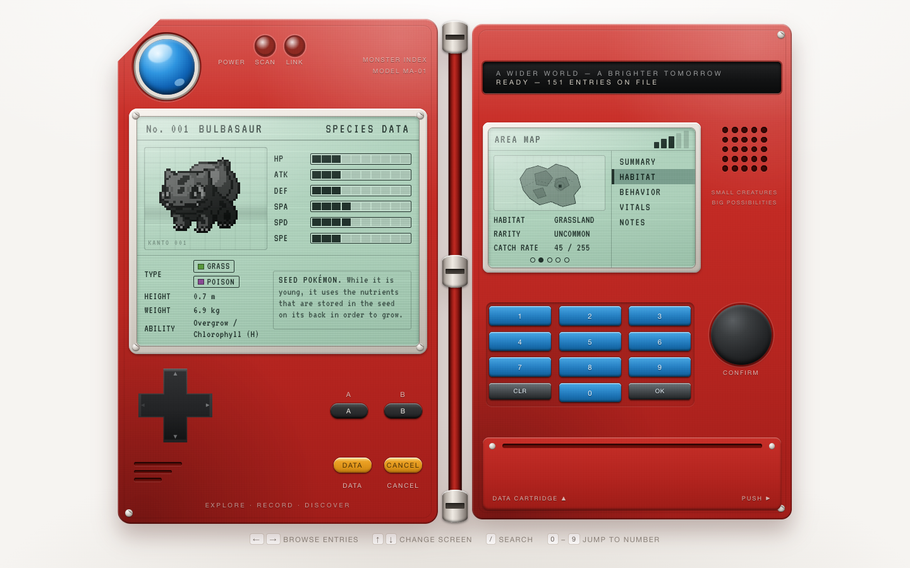
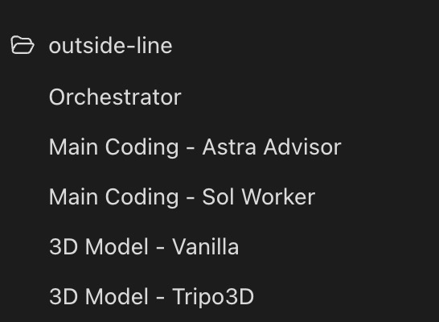

# Pokédex benchmark

**GPT-6 Astra was fastest and is the benchmark author's visual favorite. Astra + DeepSeek produced the strongest code.** All three worked in ordinary use, and all three still need robustness fixes.

[**Try all three Pokédex apps in your browser**](https://kevinkern.dev/benchmarks/pokedex). Switch between models and explore the working apps.

Three implementations of the same task, reviewed independently by Fable 5.1 and Codex. Build a physical red Pokédex with real [PokéAPI](https://pokeapi.co/) data, the original 151 Pokémon, search, keyboard navigation, caching, and a usable mobile layout.

## Original reference



## GPT-6 Astra

GPT-6 Astra (`gpt-6-astra`) worked alone in Codex Desktop with medium reasoning effort.


**Fastest prototype and fewest recorded tokens.**

The app worked in ordinary use, but too much behavior and presentation lives in one component.

<details>
<summary>GPT-6 Astra on mobile</summary>


</details>

## GPT-6 Astra + DeepSeek V4.1 Flash

GPT-6 Astra (`gpt-6-astra`, medium reasoning) led the work in Codex Desktop. DeepSeek V4.1 Flash (`deepseek-flash`, max reasoning) implemented the app and a repair pass through DeepSeek Harness. Astra supplied the architecture, reviewed the result, and made final corrections.


**Strongest code and the best starting point for a maintained app.**

This implementation has clearer state and data boundaries, although the additional robustness probes still found cache defects.

<details>
<summary>GPT-6 Astra + DeepSeek V4.1 Flash on mobile</summary>


</details>

## DeepSeek V4.1 Flash

DeepSeek V4.1 Flash (`deepseek-flash`) worked alone in DeepSeek Harness with max reasoning effort.



The code has useful separation but more confirmed interaction bugs, including a late retry replacing the selected Pokémon and male Nidoran resolving to the female entry.

<details>
<summary>DeepSeek V4.1 Flash on mobile</summary>


</details>

Desktop screenshots show the initial Bulbasaur screen at 1440 × 900. Mobile screenshots show full pages captured at a 390 × 844 viewport. Each app scrolls vertically.

## What I found

Here’s my honest take. **Astra** gave me the best overall result in this benchmark, and it finished fastest. After trying all three apps myself, it’s the one I prefer.

There is just one thing. If you want clear abstractions and code that humans can maintain, you still need to look closely. Both reviewers ranked Astra’s code below the other two in this benchmark. Too much sits in [one component](https://github.com/regenrek/pokedex-bench/blob/54158dd0196eb7e2bc700d1bab5f8272c1ca5771/pokedex-astra/src/App.tsx#L8-L373), and the CSS has [repeated layout fixes](https://github.com/regenrek/pokedex-bench/blob/54158dd0196eb7e2bc700d1bab5f8272c1ca5771/pokedex-astra/src/styles.css#L1681-L1863) that make it harder to follow.

**Astra + DeepSeek** did better here. Loading data, keeping track of the selected Pokémon, and drawing the interface are more clearly separated. It’s the codebase I would rather maintain. But it took about four times as long and used about 25 times as many recorded tokens as **Astra** alone.

**DeepSeek alone** also split the code into smaller parts, but those parts did not always work together correctly. A delayed retry could replace the Pokémon you had just selected. Some CSS names did not match the components, so the indicator lights looked wrong. More structure did not automatically mean fewer bugs.

For me, **Astra** wins on the finished result. **Astra + DeepSeek** wins on code quality. If the code needs to stay understandable over time, I would make that part of the brief and keep code review and QA in the process. This is one benchmark, not a verdict on everything these models can do.

## The numbers

| Metric | **GPT-6 Astra** | **Astra + DeepSeek V4.1 Flash** | **DeepSeek V4.1 Flash** |
| --- | --- | --- | --- |
| Time to finish | 8m 08s | 32m 39s | 23m 27s |
| Recorded tokens | 1.33 million | At least 33.76 million | At least 27.43 million |
| Code quality from Fable 5.1 | 57 / 100 | 86 / 100 | 66 / 100 |
| Code quality from Codex | 65 / 100 | 80 / 100 | 69 / 100 |

The code scores are the reviewers’ judgments. My preference after trying the apps is separate from those scores.

## How I use these models now

I agree with rethinking the skills and instructions we carry from one model to the next. OpenAI recommends [auditing skills and instruction files that influence Astra’s behavior](https://developers.openai.com/api/docs/guides/latest-model#instruction-following). My take is to remove what no longer helps, then deliberately bring back the architecture and code quality skills that matter for the repo. I wrote more about this in [my post on codebase drift](https://kevinkern.dev/posts/agentic-drift-in-large-codebase/).

`Astra` is very good at getting to the result I want. Not just from a single prompt. It follows what I mean as the work develops, often better than I manage to explain it. But if I want that result and code I can comfortably maintain, I still need to give it direction.

Beyond this Pokédex test, my current coding setup uses `GPT-5.6 Sol at medium` as the main worker and `GPT-6 Astra at medium` as an advisor. A separate `GPT-6 Astra orchestrator` is the thread I talk to. It delegates work to the other threads.



For the actual 3D work, I use `Astra` alone. It’s a [beast in my 3D experiments](https://kevinkern.dev/benchmarks/3d/audi-quattro/). Nothing else I’ve tried has come close.

Mixing models has its downsides, though. In one of my other runs, Astra threw away DeepSeek’s 3D result and rebuilt it itself without telling me first. And yeah, I wasn’t even mad. Something similar happened with Luna as the worker. Astra told me the result wasn’t good enough and did its own implementation.

That is why I wouldn’t mix models just to save money. The cheaper worker can finish its part, then the stronger model does the work again. More routing does not automatically buy you the best quality at a lower cost.

For me, there are two useful starting points. If I want a strong result quickly without managing several agents, I start with `Astra at low`. That is my general recommendation from using it, not a setting tested here. This Pokédex run used medium. For visual work, design, and 3D, I would also stay with Astra.

If the priority is code that humans can read and maintain, I would try `Sol` or `DeepSeek` as the worker, with `Astra` advising and reviewing. I would also keep architecture and code quality skills in the repo. Splitting the work can help, but it still needs direction and review.

## Run locally

Use Node.js 22.12 or newer. Choose one project folder, then run the same commands.

- [GPT-6 Astra](pokedex-astra)
- [GPT-6 Astra + DeepSeek V4.1 Flash](pokedex-deepseek-v4.1-astra)
- [DeepSeek V4.1 Flash](pokedex-deepseek-v4.1-harness)

```bash
cd pokedex-astra
npm ci
npm run dev
```

```bash
npm run typecheck
npm test
npm run build
```

The application source is unchanged. This repository contains the three projects, this summary, and comparison images. Raw transcripts, logs, private measurement records, generated builds, and temporary evaluation files stay out of Git.

This is one task with one submitted attempt per run. Model and harness names come from the recorded execution configurations. The reviews are independent, although visible folder names compromised blinding. The results describe these submissions and do not establish a general model ranking.
