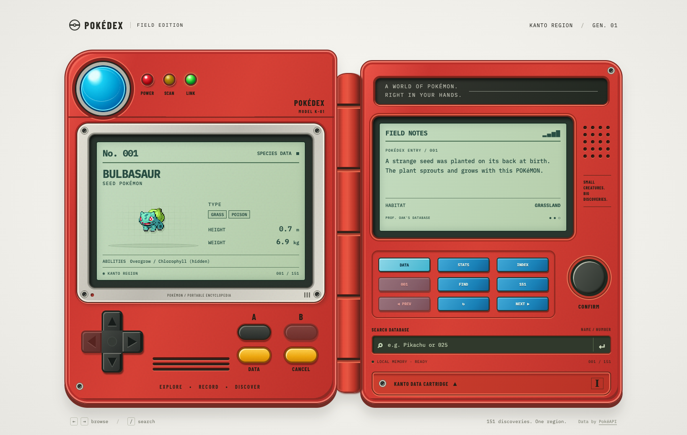
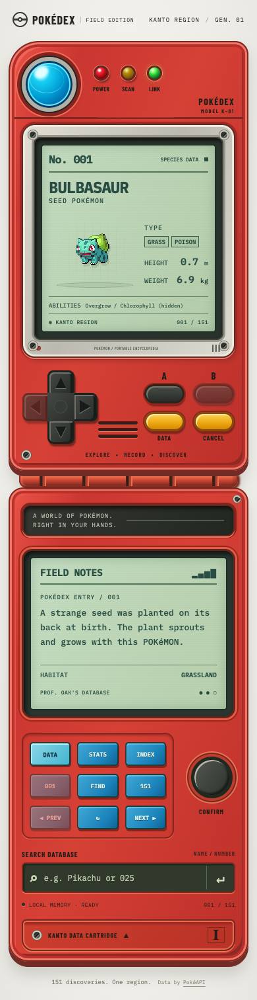
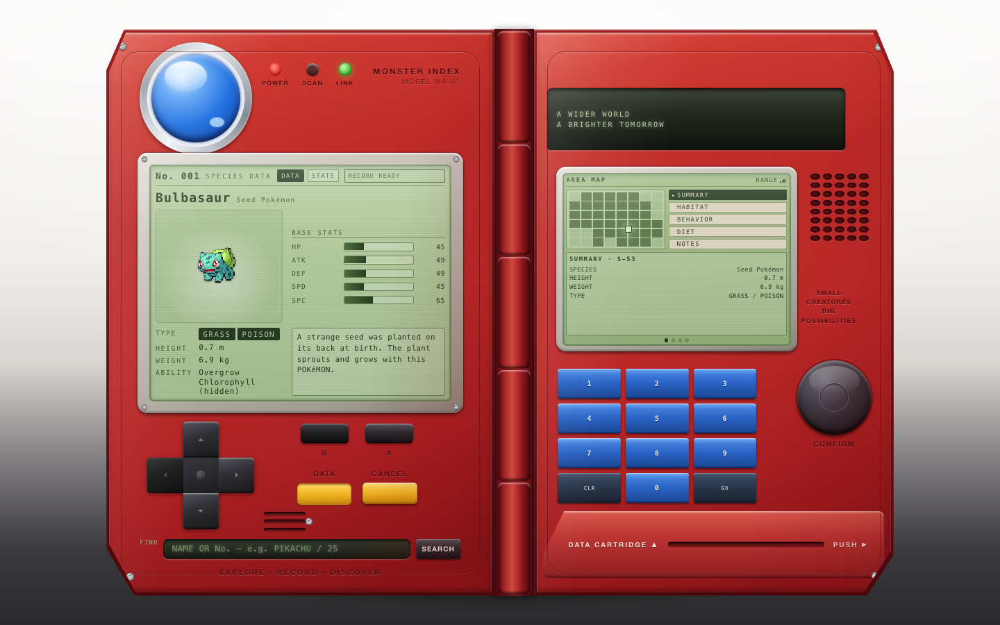
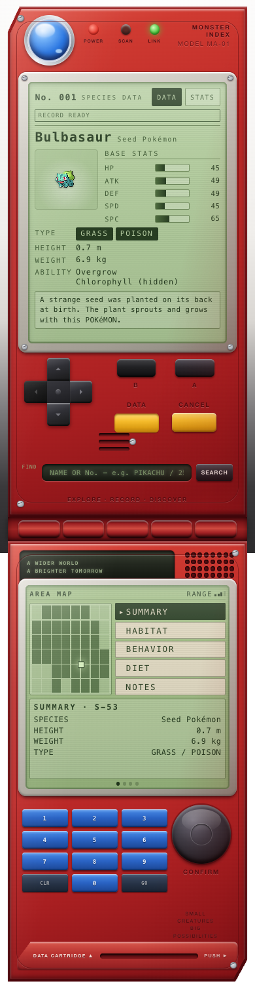

# Pokédex benchmark

**GPT-6 Astra was fastest. DeepSeek → GPT-6 Astra is the author's visual favorite among the mixed workflows. GPT-6 Astra → DeepSeek produced the strongest code among the published mixed runs.** All five worked in ordinary use and still need robustness fixes.

[**Try all five Pokédex apps in your browser**](https://kevinkern.dev/benchmarks/pokedex). Switch between models and explore the working apps.

Five implementations of the same task. Fable 5.1 and Codex reviewed the original three; Codex also reviewed the DeepSeek-led run with Astra advising and the Luna-led run with Astra implementing. Build a physical red Pokédex with real [PokéAPI](https://pokeapi.co/) data, the original 151 Pokémon, search, keyboard navigation, caching, and a usable mobile layout.

## Original reference


## GPT-6 Astra

GPT-6 Astra (`gpt-6-astra`) worked alone in Codex Desktop with medium reasoning effort.


**Fastest prototype and fewest recorded tokens.**

The app worked in ordinary use, but too much behavior and presentation lives in one component.

<details>
<summary>GPT-6 Astra on mobile</summary>


</details>

## GPT-5.6 Luna → GPT-6 Astra

Credit to [@anshuc for the workflow and approach](https://x.com/anshuc/status/2098014776886448337?s=20). This is an adaptation of their idea, not mine.

GPT-5.6 Luna (`gpt-5.6-luna`, max reasoning in the execution records) coordinated the work and ran verification. GPT-6 Astra (`gpt-6-astra`, medium reasoning) implemented the app in one fresh context and repaired the test setup in a second. The requested Luna effort was xhigh, but the recorded run used max. The repair worker also ran one focused test, a small deviation from the intended Luna-only verification.



**About the same estimated cost as Astra alone, with almost twice the elapsed time.**

| Metric | GPT-6 Astra alone | Luna → GPT-6 Astra |
| --- | ---: | ---: |
| Time to final behavioral verification | 8m 08s | 15m 28s |
| Recorded tokens | 1.33 million | 10.15 million |
| Estimated standard API cost, USD | ~$3.18 | ~$3.05 |
| Code quality from Codex | 65 / 100 | 61 / 100 |
| React Doctor 0.9.13 | 84 / 100 | 82 / 100 |

Luna accounted for about $0.25 and the two Astra calls for about $2.79. The total is around 4% below Astra alone. These are API-equivalent estimates from recorded usage at standard [Astra](https://developers.openai.com/api/docs/models/gpt-6-astra) and [Luna](https://developers.openai.com/api/docs/models/gpt-5.6-luna) rates, not subscription bills. This run does not establish a subscription-quota saving or a general conclusion about the workflow.

The type check, all 22 supplied tests, and the production build passed. Ordinary browser use, delayed-response handling, and sprite fallback also passed independent checks. Malformed API data could still crash the app and poison its cache, and searching its own displayed `NIDORAN M` name failed. The main component mixes many responsibilities, and the very dense JSX and CSS make maintenance harder. The code score is a reviewer judgment. Fable has not reviewed this submission.

<details>
<summary>GPT-5.6 Luna → GPT-6 Astra on mobile</summary>



</details>

## GPT-6 Astra → DeepSeek V4.1 Flash

GPT-6 Astra (`gpt-6-astra`, medium reasoning) led the work in Codex Desktop. DeepSeek V4.1 Flash (`deepseek-flash`, max reasoning) implemented the app and a repair pass through DeepSeek Harness. Astra supplied the architecture, reviewed the result, and made final corrections.


**Strongest code and the best starting point for a maintained app.**

This implementation has clearer state and data boundaries, although the additional robustness probes still found cache defects.

<details>
<summary>GPT-6 Astra → DeepSeek V4.1 Flash on mobile</summary>


</details>

## DeepSeek V4.1 Flash → GPT-6 Astra

DeepSeek V4.1 Flash (`deepseek-flash`, max reasoning) led the work in DeepSeek Harness and handled implementation and repairs. GPT-6 Astra (`gpt-6-astra`, medium reasoning) advised and reviewed through Codex CLI, with three reviews and two repair cycles.



**The author's visual favorite among the mixed workflows.**

Ordinary workflows passed. Independent failure tests found persistent malformed-data crashes, retry and search issues, and a missing fallback for failed sprite images. The [live comparison](https://kevinkern.dev/benchmarks/pokedex/#numbers-title) includes the full results table.

<details>
<summary>DeepSeek V4.1 Flash → GPT-6 Astra on mobile</summary>



</details>

## DeepSeek V4.1 Flash

DeepSeek V4.1 Flash (`deepseek-flash`) worked alone in DeepSeek Harness with max reasoning effort.


The code has useful separation but more confirmed interaction bugs, including a late retry replacing the selected Pokémon and male Nidoran resolving to the female entry.

<details>
<summary>DeepSeek V4.1 Flash on mobile</summary>


</details>

Desktop screenshots show the initial Bulbasaur screen at a 1440 × 900 viewport, with full-page capture where needed. Mobile screenshots show full pages captured at a 390 × 844 viewport. Each app scrolls vertically.

## Run locally

Use Node.js 22.12 or newer. Choose one project folder, then run the same commands.

- [GPT-6 Astra](pokedex-astra)
- [GPT-5.6 Luna → GPT-6 Astra](pokedex-luna-astra)
- [GPT-6 Astra → DeepSeek V4.1 Flash](pokedex-deepseek-v4.1-astra)
- [DeepSeek V4.1 Flash → GPT-6 Astra](pokedex-deepseek-v4.1-astra-v2-better-astra-advisor)
- [DeepSeek V4.1 Flash](pokedex-deepseek-v4.1-harness)

```bash
cd pokedex-astra
npm ci
npm run dev
```

```bash
npm run typecheck
npm test
npm run build
```

The application source is unchanged. This repository contains the five projects, this summary, and comparison images. Raw transcripts, logs, private measurement records, generated builds, and temporary evaluation files stay out of Git.

This is one task with one submitted attempt per run. Model and harness names come from the recorded execution configurations. The reviews are independent, although visible folder names compromised blinding. The results describe these submissions and do not establish a general model ranking.
